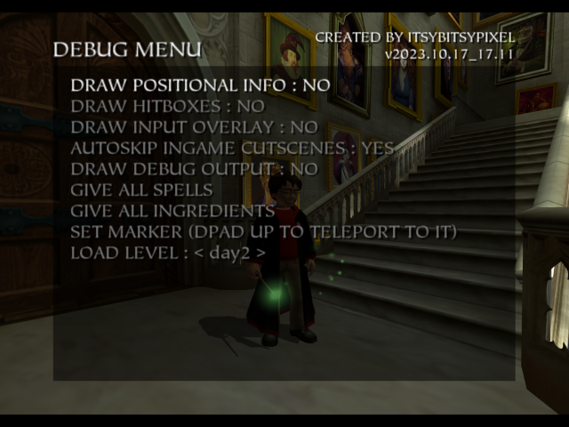

# Alohomora
A debug menu for Harry Potter and the Sorcerer's Stone / Philosopher's Stone (HP1) for Xbox. Needs a modded Xbox to work, since you'll need to replace the game's executable, but otherwise runs on original Xbox hardware.

## Features
 - Change level
 - Give spells
 - Give ingredients
 - Draw Harry's position as XYZ coordinates
 - Draw hitboxes/triggers
 - Show input overlay
 - Auto-skip speech in in-game cutscenes
 - Show leftover developer debugging prints from scripts
 - Setting a marker that can be teleported back to
 - Sets all "cinematic cutscenes" to watched so they can be skipped

## Prerequisites
 - USA copy of Harry Potter and the Sorcerer's Stone (MD5 for default.xbe : ca3a79d326aa712840d5654d3874db0c)
 - Python
 - A modded Xbox

## Patching your XBE
If you'll be playing on original hardware you'll need to copy the `default.xbe` from the game's folder over to your PC. You'll then run the `xbe_patcher.py`:

`python3 xbe_patcher.py "path/to/original/default.xbe" -p dm_patch.bin -o patched.xbe`

This will patch and output the new executable, `patched.xbe` in this case. You can then transfer it over to your Xbox and either rename and replace the original `default.xbe`, or put it alongside the original and run it through your dashboard's file explorer.

## How to use
If everything went smoothly in the previous step you should load directly into day 1 when you open the game, skipping the intro and main menu. To access the debug menu you press START while in the pause menu. This will get you into the debug menu. You navigate it the same way as the normal pause menu, via DPAD or LS, and A to select or toggle options. Then you can press START again to exit the debug menu.

## Notes
This debug menu was developed mostly as a way for speedrunners to discover new strats and practice. You can find the community over at the Harry Potter 6th Gen Speedrunning server on Discord, https://discord.gg/zcrjz5s2RJ.

If you discover any issues or have suggestions for other options or improvements, create an issue here on GitHub and I'll see what I can do.

## TODOs
 - [ ] Draw spherical and cylindrical hitboxes/triggers
 - [ ] Figure out a way to skip in-game cutscenes completely without messing up the game state
 - [ ] Noclip/freecam
 - [ ] Teleporting between savepoints in a level
 - [ ] Disable writing cache to HDD (could be culprit of crashes when switching back to original .xbe)

## Screenshots

